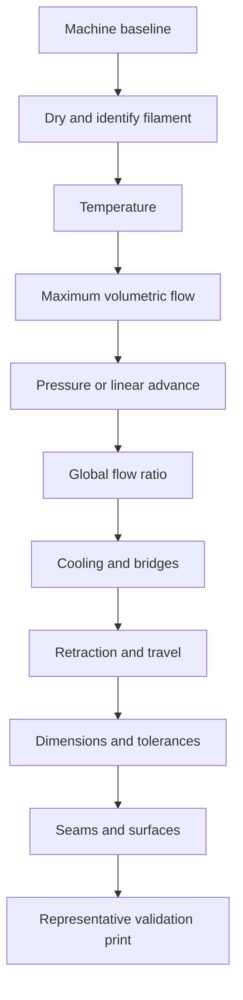

<p align="center">
  
</p>

# Tinmans Tuning Guide

A source-backed, printer-neutral handbook for building reliable FFF/FDM
filament profiles.

**[Download the complete linked PDF](output/pdf/Tinmans-Tuning-Guide.pdf)**

Slicer downloads:

- [Download the latest official OrcaSlicer release](https://github.com/SoftFever/OrcaSlicer/releases/latest)
- [Download the latest public TinmanX1 release](https://github.com/Tinman-FP/TinManX1/releases/latest)

Release pages move forward over time. The settings reference states the exact
versions and source revisions used for this edition.

This guide explains what to tune, why the order matters, how to read each test,
and how to preserve evidence so a good profile can be reproduced instead of
rediscovered. It is written for ordinary Cartesian, CoreXY, delta, bedslinger,
direct-drive, Bowden, single-tool, and multi-tool printers. Slicer and firmware
names vary, but the physical problems are the same.

## Start Here

If the printer is mechanically sound and the filament is dry, use this order:

1. [Define the baseline](guide/01-foundations.md).
2. [Condition the filament and tune temperature](guide/02-conditioning-and-temperature.md).
3. [Find a safe maximum volumetric flow](guide/03-volumetric-flow.md).
4. [Tune pressure or linear advance](guide/04-pressure-advance.md).
5. [Tune global and feature-specific flow](guide/05-flow-ratio.md).
6. [Balance cooling, bridges, and retraction](guide/06-cooling-and-retraction.md).
7. [Correct dimensions and fit](guide/07-dimensional-accuracy.md).
8. [Refine seams and surfaces](guide/08-seams-and-surfaces.md).
9. [Validate and release the profile](guide/09-validation.md).

For a symptom-first route, use the [diagnostic matrix](guide/diagnostic-matrix.md).
For unfamiliar terms, use the [glossary](guide/glossary.md).
For plain-language slicer controls, start with the [OrcaSlicer and TinmanX1
settings reference](guide/11-orca-tinmanx1-settings-reference.md).

## The Short Version



Later tests depend on earlier ones. A temperature change can alter melt flow,
pressure response, stringing, and layer adhesion. A pressure-advance change can
alter corners and seams. Dimensional compensation should therefore come after
the extrusion system is stable.

## Four Rules That Prevent Most Tuning Mistakes

1. Change one causal variable at a time after any broad search.
2. Keep a control sample and record the complete conditions.
3. Tune extrusion quality before dimensional compensation.
4. Use the setting that matches the error model.

That fourth rule is crucial:

- Use flow ratio to correct how much material is deposited.
- Use pressure advance to correct pressure lag during speed changes.
- Use shrinkage compensation for proportional cooled-part scale error.
- Use contour or hole compensation for near-constant offsets.
- Use elephant-foot compensation only for enlarged bottom layers.
- Do not alter axis calibration to hide filament shrinkage.

## What This Guide Does Not Promise

There is no universal best temperature, flow ratio, retraction distance, or
pressure-advance value. The result depends on the exact filament, color, lot,
moisture state, nozzle, hotend, extruder, layer geometry, speed, acceleration,
cooling, and chamber conditions. This guide provides a method for finding and
defending a value for a defined setup.

## Safety

- Treat hotends, beds, chambers, and freshly printed parts as burn hazards.
- Keep hands, tools, hair, and clothing clear of moving machinery.
- Follow the filament manufacturer's safety data and ventilation guidance.
- Do not leave an unproven material or profile unattended.
- Some materials release irritating or hazardous emissions. Use suitable local
  exhaust or enclosure ventilation for the material and environment.
- Dry filament only within the limits of its spool, packaging, and manufacturer.

## Repository Contents

| File | Purpose |
| --- | --- |
| [How to use this guide](guide/00-how-to-use-this-guide.md) | Test design, evidence, and decision rules |
| [Foundations](guide/01-foundations.md) | Mechanical and slicer baseline |
| [Conditioning and temperature](guide/02-conditioning-and-temperature.md) | Moisture, temperature towers, adhesion |
| [Volumetric flow](guide/03-volumetric-flow.md) | Melt-capacity ceiling and speed conversion |
| [Pressure advance](guide/04-pressure-advance.md) | Pressure lag, test reading, firmware notes |
| [Flow ratio](guide/05-flow-ratio.md) | Global and feature-specific extrusion |
| [Cooling and retraction](guide/06-cooling-and-retraction.md) | Cooling tradeoffs, bridges, travel artifacts |
| [Dimensional accuracy](guide/07-dimensional-accuracy.md) | Scale, offsets, holes, elephant foot |
| [Seams and surfaces](guide/08-seams-and-surfaces.md) | Seam diagnosis and surface refinement |
| [Validation](guide/09-validation.md) | Acceptance tests and profile release |
| [Material families](guide/10-material-families.md) | Material-specific starting priorities |
| [Settings reference and versions](guide/11-orca-tinmanx1-settings-reference.md) | Scope, version basis, and Orca/TinmanX1 difference labels |
| [Quality tab](guide/12-quality-tab.md) | Geometry, walls, surfaces, seams, and precision |
| [Strength tab](guide/13-strength-tab.md) | Shells, infill, structural paths, and Strength Lens |
| [Speed tab](guide/14-speed-tab.md) | Feature speeds, acceleration, jerk, and transitions |
| [Support tab](guide/15-support-tab.md) | Conventional, tree, raft, and TinmanX1 Wave Overhang support |
| [Multimaterial tab](guide/16-multimaterial-tab.md) | Prime towers, assignments, purge, and interlocking |
| [Others tab](guide/17-others-tab.md) | Adhesion, special modes, output, and scripts |
| [TinmanX1 fiber and strength tools](guide/18-tinmanx1-fiber-and-strength-tools.md) | Process, filament, and machine fiber controls |
| [Diagnostic matrix](guide/diagnostic-matrix.md) | Symptom-to-cause triage |
| [Glossary](guide/glossary.md) | Definitions and formulas |
| [Experiment log](templates/experiment-log.md) | Reusable test record |
| [Release checklist](templates/profile-release-checklist.md) | Final profile audit |
| [Sources](SOURCES.md) | Primary references and further reading |
| [Credits](CREDITS.md) | Attribution and authorship |
| [Complete PDF](output/pdf/Tinmans-Tuning-Guide.pdf) | Single-file publication with linked contents and cross-references |

## Evidence Standard

Every accepted value should have:

- a dated experiment record;
- the exact printer, tool, nozzle, material, and filament condition;
- the exact project or sliced G-code;
- a list of fixed variables and the one changed variable;
- photographs in a repeatable orientation;
- measurements taken after the part fully cooled;
- an explicit decision: `candidate`, `accepted`, `rejected`, or `superseded`.

The [experiment template](templates/experiment-log.md) is designed for this.

## Rebuild the PDF

The PDF is generated from the repository's Markdown sources so the web and
single-file editions stay synchronized.

```bash
python3 -m pip install -r requirements-pdf.txt
python3 scripts/build_pdf.py
```

The finished publication is written to
`output/pdf/Tinmans-Tuning-Guide.pdf`.

## License and Attribution

The original text and diagrams in this repository are licensed under
[CC BY 4.0](LICENSE). Source projects retain their own licenses. See
[CREDITS.md](CREDITS.md) and [SOURCES.md](SOURCES.md) for attribution.

Project initiated and experimentally informed by William Tinney. Researched,
written, organized, and published with Codex by OpenAI. No source author,
project, or company listed here has endorsed this guide.
