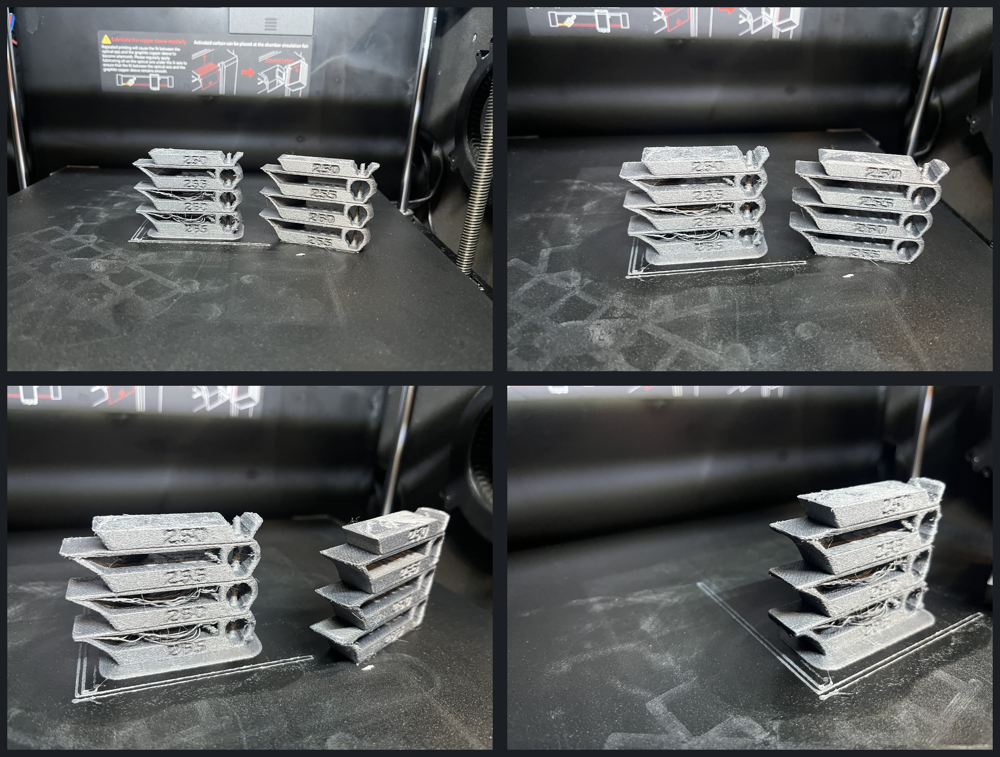

# Filament Conditioning and Temperature

Temperature tuning is meaningful only when the material condition is stable.
Water in filament can create defects that resemble poor temperature, flow,
retraction, or pressure advance.

## Moisture Symptoms

Possible signs include:

- popping, crackling, or visible vapor at the nozzle;
- rough, foamy, or inconsistent extrusion;
- bubbles, pits, blobs, or smoke-like wisps;
- excessive stringing despite reasonable retraction;
- weak or brittle layers;
- an unstable surface finish from layer to layer.

These signs are not individually conclusive, but drying is the correct first
experiment when storage history is unknown.

## Drying Safely

Use the filament manufacturer's recommendation when available. Confirm that the
spool and any label, bag, RFID tag, or hub can tolerate the dryer temperature.
Prusa's drying table is a useful cross-check, not permission to exceed a product
limit.

Record:

- dryer type and measured temperature;
- drying duration;
- spool starting condition;
- time between drying and printing;
- whether the spool remained in a dry box during the test.

## Controlled PET-CF Drying Comparison

The photographs below compare Elegoo PET-CF printed from the same G-code on
the same Qidi Plus 4, nozzle, settings, and room conditions. The operator
reported the left tower as undried and the right tower as dried. The dried
specimen has markedly cleaner bridges, fewer loose strands, more coherent
overhangs, and a more uniform surface. This is a controlled A/B result for one
spool and process, not a universal drying schedule.

The comparison is also a useful diagnostic warning: moisture can produce
defects that look like excessive temperature, poor retraction, weak bridging,
or unstable flow. Dry and stabilize the spool before changing several slicer
variables to chase those symptoms.

## What Nozzle Temperature Changes

Higher temperature generally lowers melt viscosity and can improve high-flow
extrusion and layer bonding. It can also increase ooze, stringing, gloss,
degradation, and loss of small-feature definition.

Lower temperature may sharpen details and reduce ooze, but can cause poor
bonding, incomplete melting, high backpressure, skipped extrusion, or a matte
under-extruded surface.

The useful temperature therefore depends on flow rate and purpose. A slow
display print and a fast structural print may need different values.

## Design a Temperature Tower

1. Begin inside the manufacturer's safe range.
2. Use steps large enough to reveal a trend, commonly `5 C`.
3. Keep layer height, width, speed, cooling, and geometry fixed.
4. Verify in G-code preview or text that temperature commands occur at the
   intended heights.
5. Label each segment in the model or experiment record.
6. Include a range above and below the expected optimum when safe.

A tower does not identify an optimum if the best section is at the hottest or
coldest tested endpoint. Extend the range in that direction.

## Read the Tower

Evaluate every segment for:

- consistent walls and surface finish;
- overhang edge definition and curl;
- bridge sag and strand coherence;
- stringing and wisps;
- small-feature and text fidelity;
- corner quality and seams;
- discoloration or signs of degradation;
- layer adhesion after cooling.

Photographs are useful for appearance, but they cannot prove layer strength.
Use a controlled bend or break comparison when adhesion matters. Keep geometry
and loading consistent and use eye protection.

## Selection Rule

Choose the lowest temperature that provides the required adhesion and stable
flow at the intended production rate, unless a hotter setting produces a
materially better mechanical result with acceptable detail and stringing.

For high-flow work, confirm the selected temperature again during the
volumetric-flow test. A visually good low-speed tower section may not melt fast
enough for production.

### Preserve Margin Above a Cold-Flow Failure

The dried Elegoo PET-CF tower below ran from `265 C` at the bottom through
`260 C`, `255 C`, and `250 C`. Two attempts stopped at approximately the same
point as the program moved toward the next, colder step. After cancellation,
the same filament path extruded `300 mm` normally after the nozzle was heated
to `300 C`. That result is consistent with insufficient melt capacity at the
low-temperature endpoint rather than a persistent clog.

For this machine, `0.6 mm` nozzle, and test flow, `255 C` is the defensible
working selection. The `250 C` tier is visually competitive, but it is only one
`5 C` step above the repeatable loss-of-flow boundary. The `255 C` tier retains
clean walls, readable detail, and acceptable bridge behavior while preserving
process margin. Treat that value as a test-specific starting point and confirm
it again at the intended production volumetric flow.

## First-Layer Temperature

A hotter first layer can improve wetting and reliability, but it is a separate
setting from normal-layer temperature. Excess heat can increase ooze, elephant
foot, or polymer degradation. Tune it only after Z offset and plate preparation
are correct.

## Common Misreads

| Observation | Do not assume | Check |
| --- | --- | --- |
| Stringing | temperature is too high | moisture, travel, retraction, nozzle residue |
| Matte upper tower | temperature is too low | whether flow rate also increases with height |
| Weak bridge | temperature alone is wrong | bridge fan, speed, flow, line width |
| Rough surface | over-extrusion | wet filament, partial clog, unstable temperature |
| Best result at endpoint | endpoint is optimum | extend the range safely |

Once temperature is bracketed, find the system's usable
[volumetric-flow limit](03-volumetric-flow.md).
