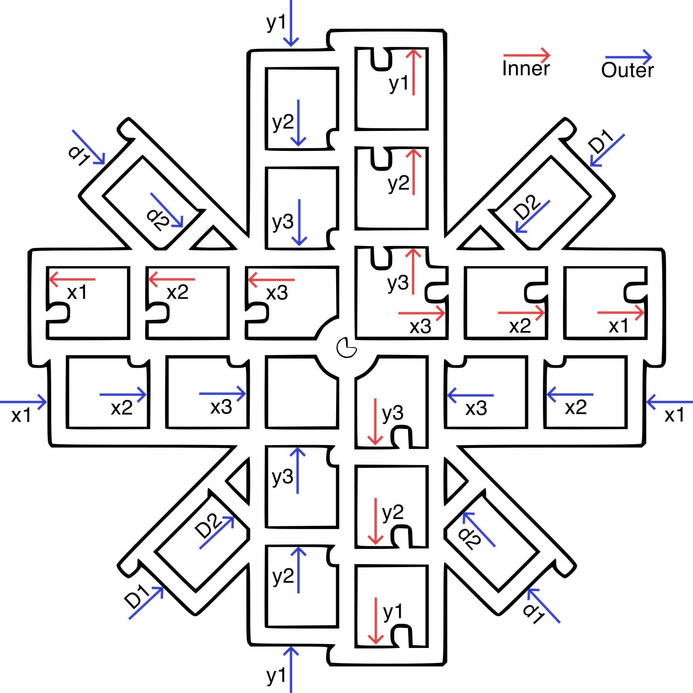

# Dimensional Accuracy and Tolerances

Dimensional tuning works only when the cause of the error is classified. A
proportional scale error, a constant contour offset, an undersized hole, and an
elephant foot require different controls.

## Measure After Extrusion Is Stable

Settle temperature, MVS, PA, flow, and cooling first. Otherwise a geometry test
can accidentally encode an extrusion defect into compensation.

Measurement protocol:

1. Let the part fully cool and condition consistently.
2. Zero and check the measurement tool.
3. Measure several points and both principal XY axes.
4. Avoid seams, corners, embossed text, and bottom flare.
5. Record raw values before averaging.
6. Use a larger test piece when the expected correction approaches the tool's
   uncertainty.
7. Include external and internal features.

## Choose the Test by the Question

No one print can establish every kind of geometric accuracy. Use the artifact
that separates the suspected causes instead of applying a correction from the
most convenient print.

| Question | Appropriate evidence | Do not conclude |
| --- | --- | --- |
| Is the printer broadly producing a clean, recognizable part? | A Benchy or another geometry-rich benchmark; inspect hull, bridges, text, holes, overhangs, seams, and ringing. | That one Benchy dimension proves axis calibration or a global scale value. |
| Is cooled-part size proportional over several sizes? | A tiered dimensional stack with several nominal X/Y lengths; record the signed X and Y results for every tier. | That a single 20 mm cube is enough to distinguish flow, contour width, shrinkage, or motion. |
| Are X/Y scale, skew, and flow-related contour offset separable? | A purpose-built multi-point grid such as the open-source Calistar pattern; measure matched outer and inner spans at every marked location. | That a shared XY shrinkage value is valid when the axes disagree. |
| Does the machine move the commanded distance? | A dial indicator or other rigid external metrology while commanding raw axis motion. | That a printed plastic feature alone justifies changing rotation distance or steps. |

<!-- pdf:page-break-before -->

### Calistar 120 x 3 measurement layout



**Figure attribution and license.** This figure is rendered from the original,
unmodified SVG measurement map from
[Calistar (formerly Fleur de Cali) by dirtdigger](https://github.com/dirtdigger/fleur_de_cali).
It is distributed with the Calistar project under GPL-3.0; the source SVG and
a copy of that license are included in this repository at
`assets/third-party/calistar/` and are **not** relicensed under this guide's
CC BY 4.0 license. The PNG above is only a white-background raster rendering
for this PDF. Calistar is an independent, open-source tool; use its models and
worksheet under the project's own license and attribution terms.

**Commercial alternative credit.** The separately licensed, paid
[Califlower Calibration Tool Mk2 by Adam Meadows / Vector 3D](https://vector3d.shop/products/califlower-calibration-tool-mk2)
is the official for-profit product commonly associated with this style of
dimensional-and-skew calibration. It is not the source of the Calistar diagram
above, and no Califlower files or instructions are reproduced in this guide.

The [Kickstarter/Autodesk FDM assessment protocol](https://github.com/kickstarter/kickstarter-autodesk-3d/tree/master/FDM-protocol)
is a useful tiered reference: it asks for separate X and Y measurements at
multiple nominal sizes and explicitly compares the axis averages. Its published
scoring conditions use a controlled PLA material; a PCTG run is still valuable
as a machine-and-material characterization, but its score is not comparable to
that PLA reference.

Benchy is an excellent diagnostic artifact, not a dimensional-compensation
calculator. Its nominal `60 × 31 × 48 mm` envelope is a useful reference, but
the hull/deck transition, wall sequencing, infill support, cooling, and line
width make it the wrong sole basis for changing machine motion or a whole-model
scale. Treat a localized hull line as a model/thermal diagnostic unless the
same periodic or directional error appears on a separate artifact.

## Classify the Error Model

### Proportional material scale error

The error grows with feature size. Use per-filament shrinkage or scale
compensation.

### Nearly constant external offset

Different-sized external features are all too large or small by a similar
absolute amount. Use contour compensation after confirming flow and PA.

### Internal holes differ from external contours

Use hole compensation, precise-wall controls, polyholes, or a design tolerance
after testing multiple hole sizes and orientations.

### Bottom layers alone are enlarged

Use elephant-foot compensation, first-layer/Z correction, or bed-temperature
changes. Do not scale the entire model.

### X and Y disagree

Investigate belts, squareness, mechanics, axis-specific motion, cooling
direction, and measurement method before applying one shared material value.

### Opposite-signed X/Y error is a stop condition

If one axis is long while the other is short, do **not** apply a shared XY
shrinkage value, global model scale, or a flow change. A common proportional
correction cannot make `X = nominal + error` and `Y = nominal - error` both
better. First run a multi-size or multi-point XY artifact, keep the material
profile unchanged, and inspect belt path/tension, gantry squareness, motion
repeatability, cooling direction, and the measurement method. Only then decide
whether the result is a motion issue, skew, a persistent contour offset, or
material behavior.

For example, a Benchy whose length is `+0.50 mm` from its nominal reference
while width is `-0.50 mm` is evidence for an axis-specific follow-up test, not
evidence for a `+/- 0.5 mm` slicer-scale edit. Record the signed readings;
averaging their magnitudes would hide the diagnostic fact that the signs
disagree.

## Proportional Compensation Formula

For slicers that request the measured cooled percentage, including OrcaSlicer's
documented shrinkage field:

```text
measured percentage = measured dimension / nominal dimension * 100
effective correction scale = 100 / measured percentage
```

If a nominal `100.00 mm` feature measures `99.40 mm`:

```text
measured percentage = 99.40%
correction scale = 100 / 99.40 = 1.006036
```

The slicer expands the model by about `0.6036%`.

## Worked Field Example

A controlled `20.00 mm` cube measured:

```text
X = 20.13 mm
Y = 20.13 mm
Z = 20.00 mm
```

The measured XY percentage was:

```text
20.13 / 20.00 * 100 = 100.65%
```

The corresponding effective scale was:

```text
100 / 100.65 = 0.993542
```

After entering `100.65%` as the XY measured percentage and retaining `100%` in
Z, the confirmation cube measured exactly `20.00 x 20.00 x 20.00 mm`.

This result was produced in a controlled September 2026 experiment by William
Tinney with analysis by Codex. It demonstrates the convention, not a universal
material value. A small cube is a fast test; confirm the result on a larger
artifact and a functional tolerance model.

## Why a Value Above 100% Can Be Correct

The field name may say "shrinkage," but OrcaSlicer documents it as the
percentage actually measured after cooling. If a printed feature is larger than
nominal, the measured percentage is above `100%`, and the slicer scales it down.

Always verify the convention used by the exact slicer and version. Other tools
may request a correction percentage rather than a measured percentage.

## Never Fix Material Scale with Axis Steps

Axis steps or rotation distance describe the machine's motion. Changing them to
fix one filament makes every other material and machine coordinate wrong. Use
axis calibration only for a demonstrated motion error, and use filament
shrinkage for material-specific proportional error.

## Holes and Fits

Printed holes are influenced by polygon approximation, extrusion width,
pressure, cooling, seam placement, bridge behavior, and the measurement axis.
Test several diameters and orientations.

For mating parts, tune to the required clearance rather than an abstract perfect
number. Keep separate acceptance classes for sliding, locating, press, and
threaded fits.

## Avoid Double Compensation

Do not manually scale a model when the filament profile already applies
shrinkage unless the model needs an additional intentional change. Likewise,
do not bake a calibration transform into a project and apply the same profile
correction again.

With geometry credible, refine [Seams and Surfaces](08-seams-and-surfaces.md).
