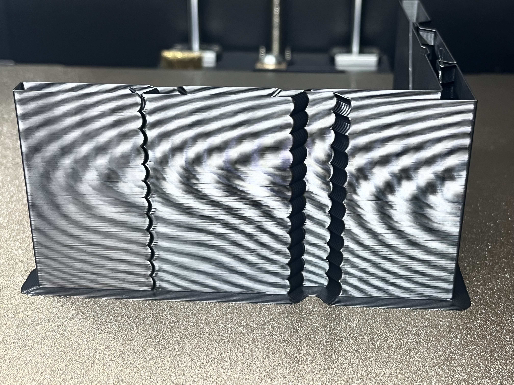
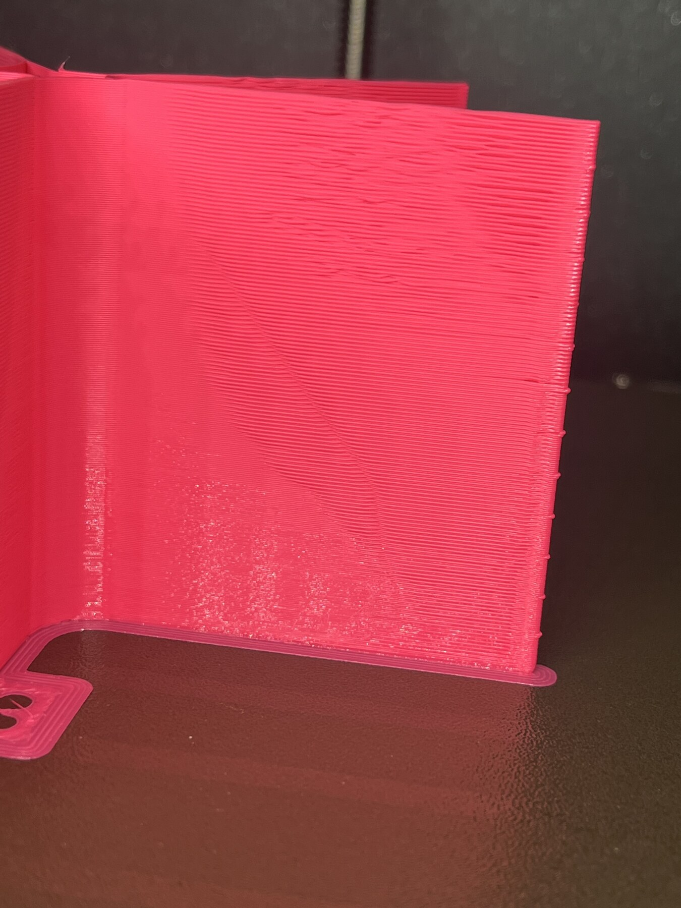
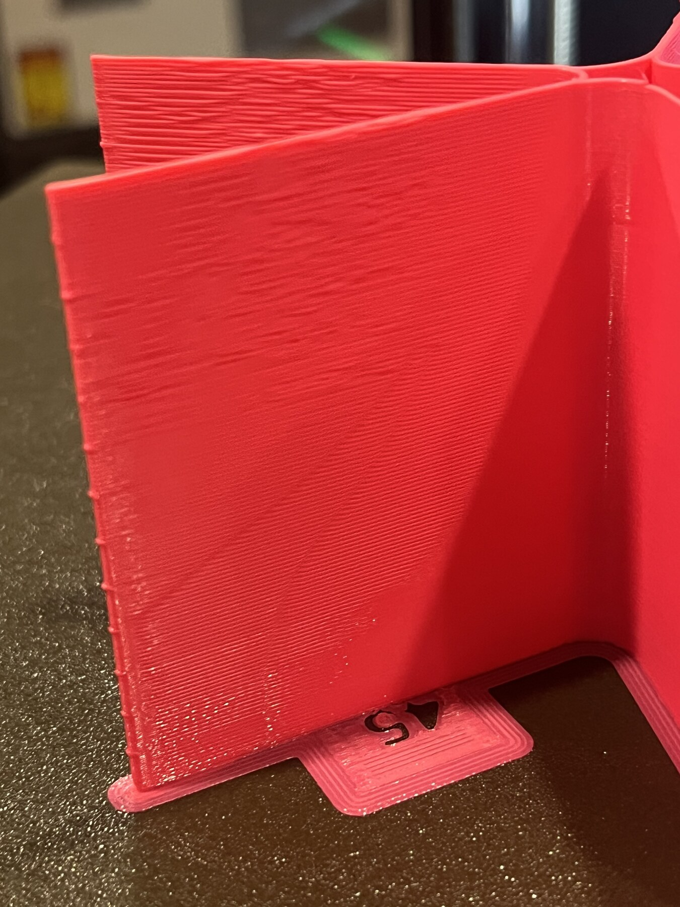
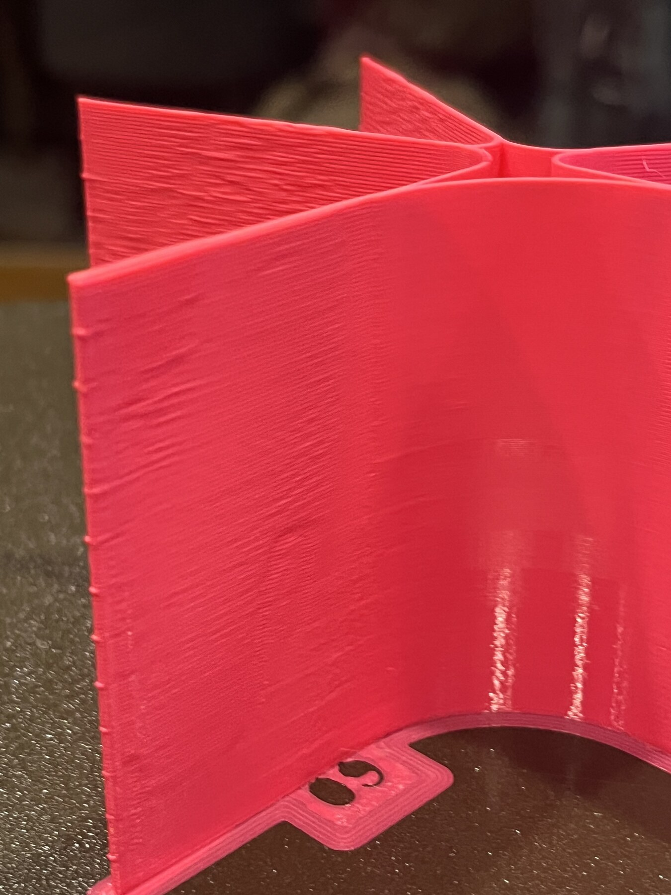
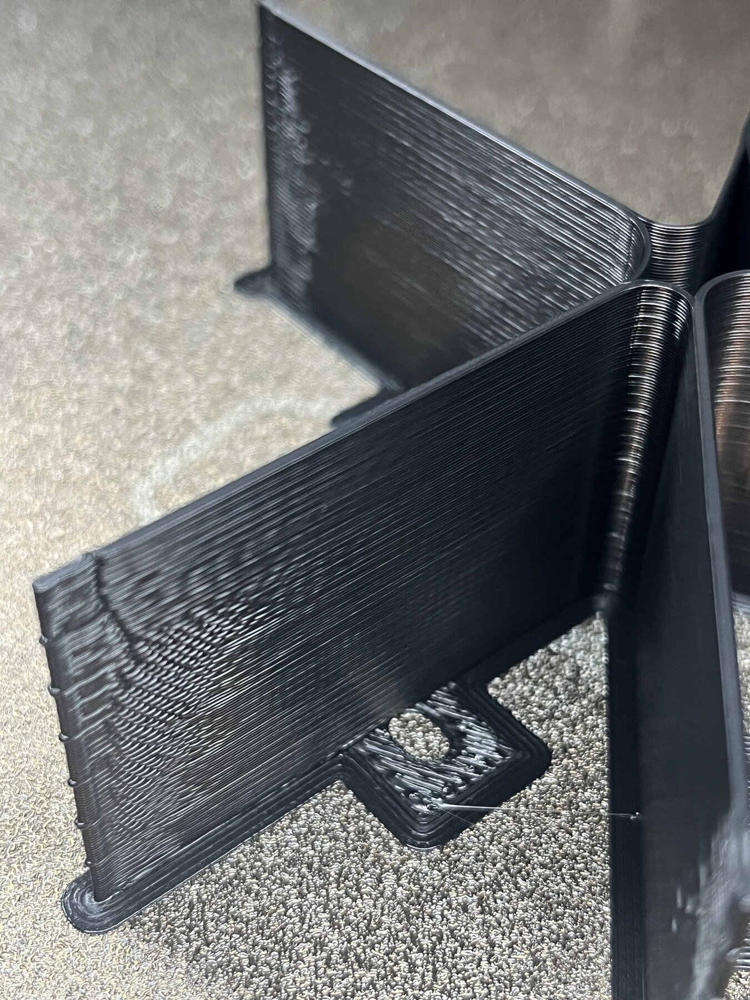
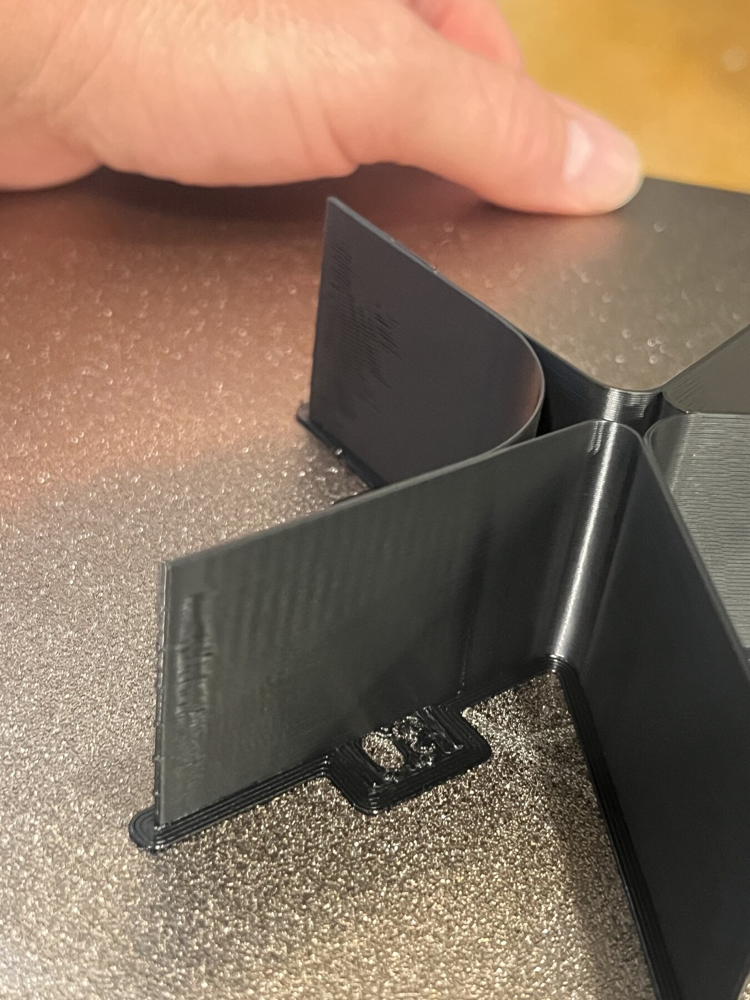
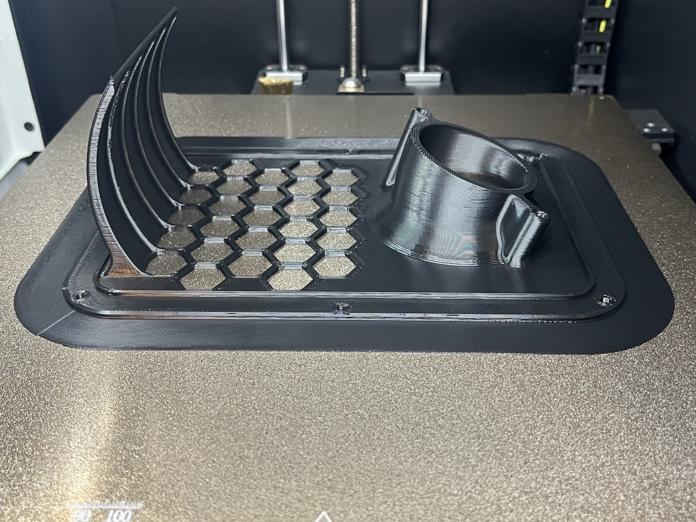
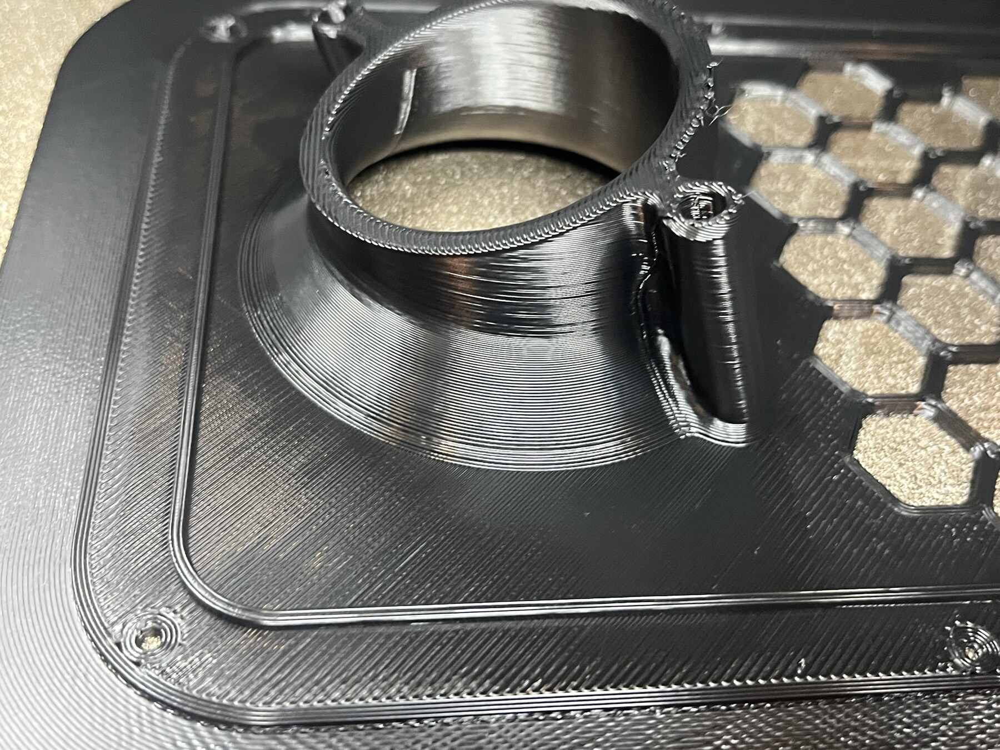
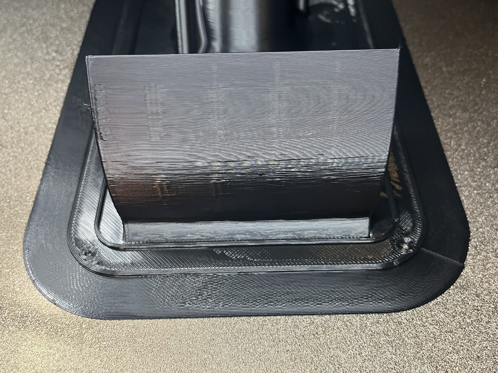

# Motion Diagnostics: Acceleration, Input Shaping, and VFA

Ringing, frame motion, vertical fine artifacts, and geometry showing through a
wall can all look like vertical bands in a photograph. They do not respond to
the same setting. Use the shape, direction, and repeatability of the evidence to
choose the test before changing the profile.

## Separate the Failure Families

| Evidence | Best first test | What the test can establish | What it cannot establish |
| --- | --- | --- | --- |
| Ripples trail a sharp corner | ringing tower or input-shaper measurement | dominant resonance and residual corner echo | best wall speed or melt limit |
| A layer shifts and every feature above it moves | conservative acceleration/step-loss test and mechanical inspection | loss of registration or mechanical instability | cosmetic optimum below the failure point |
| Fine vertical texture changes with wall speed | VFA speed sweep | quieter and louder speed ranges | maximum volumetric flow by itself |
| Bands align with hidden ribs, holes, or infill | representative wall coupon | internal-feature print-through | general machine resonance |
| Gloss changes where feature roles change | sliced-toolpath review | speed, flow, cooling, or acceleration transition | axis calibration error |

Do not call every repeated mark ringing. Ringing follows a disturbance and
decays away from it. VFA often continues along a nominally steady wall. Hidden
geometry print-through remains registered to the feature behind the wall.

## Input Shaping Is Not an Acceleration Limit

An accelerometer-based shaper calibration identifies resonant frequencies and
estimates the smoothing introduced by candidate filters. The reported
"recommended maximum acceleration" is a smoothing guideline for that shaper,
not proof that the printer will hold registration, produce its best surface, or
extrude correctly at that value.

Use measured input shaping to reduce a known resonance. Then validate motion
with a printed part. Save the axis, shaper type, frequency, damping value when
available, accelerometer mounting, toolhead configuration, and date. Re-run the
measurement after changing toolhead mass, belt path, frame stiffness, or major
gantry components.

## Run an Acceleration Tower as a Controlled Experiment

1. Use a model with deliberate sharp features on both axes and enough height
   for several clearly labeled bands.
2. Hold wall speed, layer height, line width, temperature, flow, PA, cooling,
   wall order, and material condition fixed.
3. Start below the current production acceleration and stop below known motor,
   frame, firmware, and shaper limits.
4. Confirm in the G-code or firmware log that the intended acceleration owns
   each band. A later slicer `M204` or `M205` command can silently override an
   earlier firmware tuning command. Audit the last effective writer, then
   verify live state after extrusion begins.
5. Compare broad faces, corner echoes, registration, and dimensional shape.

The first band with skipped steps, layer displacement, or growing skew is a
mechanical failure boundary. Apply margin below it. A stable highest band is
not automatically the best profile value.

### How to read a tower with no visible knee

If every band remains registered and the corner echoes do not change clearly,
record the tested range as mechanically stable and stop. Do not select the top
number merely because it printed. The test did not resolve a cosmetic optimum.
Use a geometry-representative comparison or change test families.



## Use a VFA Sweep for Speed-Dependent Texture

A vertical-fine-artifact test changes outer-wall speed in height bands while
printing repeated curves and angled faces. It is useful when broad curved walls
show vertical texture but axis-aligned faces or an acceleration tower remain
comparatively smooth.

Before the test:

- dry and identify the filament;
- settle temperature, maximum volumetric flow, PA, and global flow;
- use the production nozzle, layer height, line width, cooling, and input
  shaping;
- choose one fixed acceleration that is already mechanically credible;
- disable adaptive speed features that would blur the commanded bands;
- keep the model orientation fixed for every comparison.

Choose the upper speed with the volumetric-flow check:

```text
required flow = line width x layer height x speed
```

For a `0.60 mm` line, `0.30 mm` layer, and `80 mm/s` wall, the nominal request
is `14.4 mm3/s` before slicer-specific width and flow adjustments. The test is
not valid if the slicer caps the upper bands at the filament's maximum
volumetric flow. Inspect the preview or emitted feed rates.

### Reading the VFA tower

1. Mark the speed represented by every height band.
2. View each major face under diffuse light and then glancing light.
3. Look for texture that begins, ends, or changes wavelength at a speed
   boundary.
4. Prefer the middle of a broad quiet region over a single unusually clean
   line.
5. Reject a visually quiet band if it approaches the melt-flow ceiling,
   weakens layer bonding, or damages dimensions.
6. Confirm the candidate on the original geometry.

If every band looks alike, the result is still useful: steady wall speed is not
the dominant variable in the tested range. Investigate internal-feature
print-through, wall thickness/order, belt or roller periodicity, and
feature-role transitions before changing material flow.

### Use wall angle to localize a CoreXY motion source

A multi-vane VFA specimen can do more than select a quiet speed. On a CoreXY
machine, different wall headings load the two motor-and-belt loops by different
amounts. If the same height band is quiet on one heading and noisy on another,
the contrast can separate a motion path from a filament-wide problem.

For the common ideal CoreXY transform, a unit move at heading `theta` gives
relative loop demand:

```text
A = cos(theta) + sin(theta)
B = cos(theta) - sin(theta)
```

Use the absolute values when comparing demand. Motor names, signs, and which
physical belt is called A or B vary by machine, so verify the printer's routing
before naming a component. Also derive the actual line heading from the model
or G-code; an embossed vane label can describe the panel arrangement rather
than the emitted segment direction.

| Actual wall heading | Relative loop A | Relative loop B | Diagnostic value |
| ---: | ---: | ---: | --- |
| 0 degrees | 1.000 | 1.000 | both loops equally |
| 30 degrees | 1.366 | 0.366 | A dominant, not exclusive |
| 45 degrees | 1.414 | 0.000 | A isolated in the ideal transform |
| 90 degrees | 1.000 | 1.000 | both loops equally, with a different Cartesian direction |
| 135 degrees | 0.000 | 1.414 | B isolated in the ideal transform |

This comparison is strongest when the specimen includes both `45` and `135`
degree walls. Without the opposite diagonal, one loop can be isolated while
the other remains only dominant, which limits the conclusion.

Classify the mark before assigning it to a loop:

- broad periodic waves that continue through a constant-speed wall field are
  motion evidence;
- beads, pits, or curls confined to a seam, free edge, corner, or band change
  remain pressure-advance, retraction, cornering, and thin-wall candidates;
- progressive thinning or missing extrusion across every heading remains a
  melt-flow or feed-path candidate;
- a band fixed at the same Z height on every heading is more consistent with a
  layer event or Z-related source than an XY-loop order.

Do not stop at a visual angle comparison. Test whether the wavelength or onset
speed matches a physical order. For belt pitch `p`, pulley tooth count `N`, and
linear belt speed `v_belt`:

```text
tooth-pass frequency = v_belt / p
one-pulley-revolution distance = N x p
```

On an axis-aligned CoreXY move, each active loop commonly runs at the Cartesian
wall speed. On a single-loop `45` or `135` degree move, the active loop runs at
approximately `sqrt(2)` times Cartesian speed. A belt-related frequency should
therefore appear at about `1/sqrt(2)` of the axis-wall Cartesian speed on the
single-loop diagonal. The corresponding wall-space orders are `p` versus
`p/sqrt(2)` for one tooth and `N x p` versus `N x p/sqrt(2)` for one pulley
revolution.

A matching order is evidence, not a verdict. A plucked-belt tuning frequency is
not guaranteed to equal the loaded operating mode, and the same order can be
amplified by pulley eccentricity, idler runout, belt-edge contact, gantry
compliance, or rail preload. Preserve the current state before touching it,
then inspect in this order:

1. Both motor pulleys: set screw on the shaft flat, second screw tight, correct
   axial height, no axial walk, low runout, and full-revolution clearance.
2. Every idler and spacer in each loop: no notchiness, axial play, wobble,
   debris, tooth-on-smooth-idler contact, or persistent belt-edge witness mark.
3. Belt planes and anchors: no twist, edge polish, fray, vertical tracking
   change, asymmetric toolhead seating, or loose clamp.
4. Shared gantry interfaces: square geometry, X-rail mounting stress or tight
   spots, carriage rock, Y-guide drag, and position-dependent cable or PTFE
   load.

Do not repeatedly retension by feel between comparison prints. Record the
before state, change one identified condition, re-run any motion compensation
invalidated by that change, and repeat the same final G-code. A compact
`0/45/90/135` degree control provides both equal-loop and isolated-loop views.

### Bounded field finding: GT1.5 conversion

One controlled CORE One L-to-L+ investigation used GT1.5 belts, 21-tooth motor
pulleys, and byte-identical `40-160 mm/s` VFA G-code across repeated prints.
The walls remained fully fed after temperature, flow, pressure advance, and
maximum volumetric flow had been settled. Gantry squaring, belt tuning, phase
stepping, input shaping, homing, Z alignment, and load-cell checks did not
remove the direction-dependent face waves.

The three photographs below are from the same completed job and the same final
G-code. Read each wall from the lower `40 mm/s` band toward the upper
`160 mm/s` band. Lighting and camera angle differ, so use them to compare onset
and pattern family rather than to calculate a numerical amplitude ratio.



Axis-aligned walls were worst in the `130-160 mm/s` bands. With `1.50 mm`
pitch, those speeds produce `86.7-106.7 Hz` tooth pass; the `130` and
`140 mm/s` bands produce `86.7` and `93.3 Hz`, inside the machine's documented
`85-95 Hz` belt-tuning range. The isolated `45` degree face began showing the
same family around `90-100 mm/s`, close to the `90.2-100.8 mm/s` range predicted
by the `sqrt(2)` loop-speed shift.





That agreement promoted the GT1.5 pulley, idler, belt-plane, and shared-gantry
interfaces above more filament tuning. It did **not** prove that a particular
pulley or belt was defective, and the investigation had not yet completed the
one-component correction test at publication time. This is the appropriate
claim boundary for a frequency-and-angle correlation.

## Worked Field Example

A moving-bed printer produced dimensionally correct ABS parts but showed broad
vertical texture on a large curved cover. Its production outer wall used
`48 mm/s` and `1200 mm/s2`. Measured input shaping was active. A conservative
`300-1500 mm/s2` acceleration tower retained registration through every band,
and the deliberate corner echoes did not develop a repeatable step change.

The correct conclusion was limited: the machine was mechanically stable
through the tested acceleration range under those conditions. The tower did
not prove that `1500 mm/s2` was ideal, and it did not support changing the
already validated flow or dimensional compensation. The next test held
acceleration at `1200 mm/s2` and swept outer-wall speed from `20` to `80 mm/s`
in seven 5 mm bands.

That follow-up also exposed a useful preflight lesson. Its machine-contract
block requested square-corner velocity `1 mm/s`, but a later slicer `M205`
line became the effective writer and live firmware reported `10 mm/s`. The
test remained controlled because the value stayed fixed across every speed
band, but the record had to use the live value. Do not infer active motion
state from the first matching command in a file.

### Physical VFA result

The printed sweep resolved a useful quality window. Read this particular
artifact by height: the final file changed every outer wall from `20` to
`80 mm/s` in 5 mm bands from bottom to top. The embossed speed numbers around
the base came from the source model and did not identify the active speed of
each vane after postprocessing.

Under both diffuse and glancing light, the coarsest repeating texture appeared
from `30-50 mm/s`. The `60 mm/s` band improved, while `70-80 mm/s` formed the
broadest quiet region. The result was also direction-sensitive: some vane
orientations displayed the pattern much more strongly than others at the same
height. That combination supports a speed-dependent motion interaction rather
than random moisture, global flow error, or Z-axis banding.



The selected candidate was `70 mm/s`, with acceleration held at
`1200 mm/s2`. Although `80 mm/s` was often visually competitive, its nominal
flow request was `14.4 mm3/s` against a recorded `15 mm3/s` material limit.
Choosing `70 mm/s` preserved more melt-flow margin and followed the rule of
using the middle of a broad quiet region.



Do not score the unsupported free-edge loops as broad-wall VFA. The thin test
edge and abrupt speed changes can expose pressure and corner-velocity
transients that are not representative of a closed production wall. Judge the
field away from the edge, then validate the selected speed on the real
geometry.

### Representative-part confirmation

The same machine then printed the original curved cover with only the normal
outer-wall speed changed from `48` to `70 mm/s`. First-layer walls retained
their original speed, acceleration remained `1200 mm/s2`, pressure advance
remained `0.025`, and the production nozzle, layer height, line width,
temperature, cooling schedule, wall order, flow, and input shaping were held
constant. The uploaded and downloaded G-code matched byte-for-byte, and live
firmware state confirmed the intended contract during the print.



The broad repeating texture on the production curves was substantially reduced.
That confirmed `70 mm/s` as the production outer-wall value for this exact
machine, material, `0.6 mm` nozzle, `0.30 mm` layer, and `0.60 mm` line-width
profile. It is not a general maximum or a universal FibreSeek setting.



One horizontal texture and gloss band remained on a tall wall. Toolpath review
showed no change to that wall's XY geometry or commanded outer-wall speed at
the band. Other regions on the same layers changed from wall-dominated motion
to solid infill, bridge, and top-surface work; layer time fell and normal fan
commands increased. That makes cooling and layer context the stronger next
hypothesis.



Adaptive layer height is not the right first tool for this vertical curve.
The curve is traced in XY on every layer, so changing Z height does not add XY
facets or correct a speed-dependent wall texture. Adaptive layers help sloped
or curved surfaces whose shape changes with Z. For this residual band, keep
geometry and motion fixed and run a one-variable cooling comparison instead.
The next validation therefore holds ordinary part cooling at 20% while
preserving the original 100% bridge-fan pulses and fan-off commands.

This example is evidence about one machine, material, nozzle, and setup. Its
numbers are not universal recommendations. The reusable lesson is the decision
logic: a completed high band proves survival, while a visible and repeatable
knee is needed to select a cosmetic limit.

## OrcaSlicer and TinmanX1 Version Note

The TinmanX1 `2.4.2` build documented in this edition provides a VFA dialog with
start speed, end speed, and step size. Its built-in test uses a fixed 35 mm
model and changes speed every 5 mm. It does not expose the newer nozzle-aware
auto-scaling options described for OrcaSlicer builds after `2.4.2`. With a
larger nozzle or layer height, verify model size, requested volumetric flow,
actual feed rates, and the number of usable bands before printing.

Do not assume a later OrcaSlicer calibration screen and TinmanX1 `2.4.2` create
identical geometry or ranges. Record the application version with every saved
test. See the [version basis](11-orca-tinmanx1-settings-reference.md) and the
[Speed tab](14-speed-tab.md) for the controls that remain active around the
calibration.

## Minimum Experiment Record

Keep these fields with every motion test:

- printer kinematics, tool, nozzle, and build-plate orientation;
- slicer name/version and firmware version;
- source model and final G-code hashes;
- material, drying state, temperature, cooling, flow, PA, and MVS;
- input-shaper settings and square-corner or jerk setting;
- fixed speed or acceleration and the exact band map;
- photographs of at least two faces in consistent lighting;
- accepted range, rejected range, uncertainty, and next isolated test.

Return to [Seams and Surface Quality](08-seams-and-surfaces.md) for local path
artifacts, or continue to [Validation and Profile Release](09-validation.md)
after a candidate survives representative geometry.
