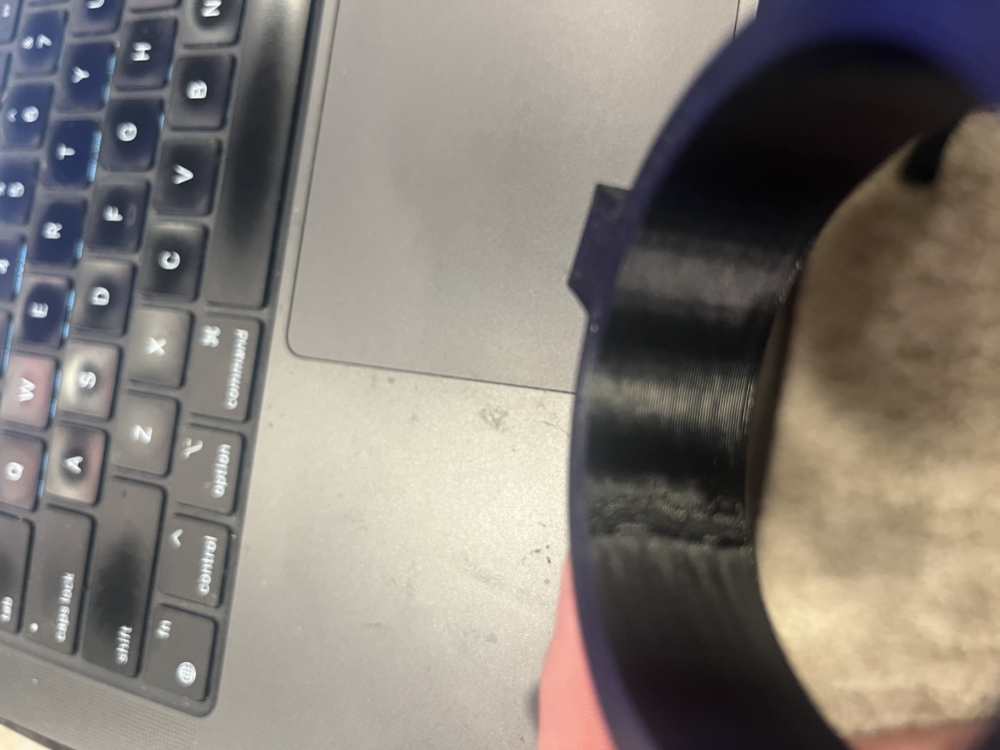
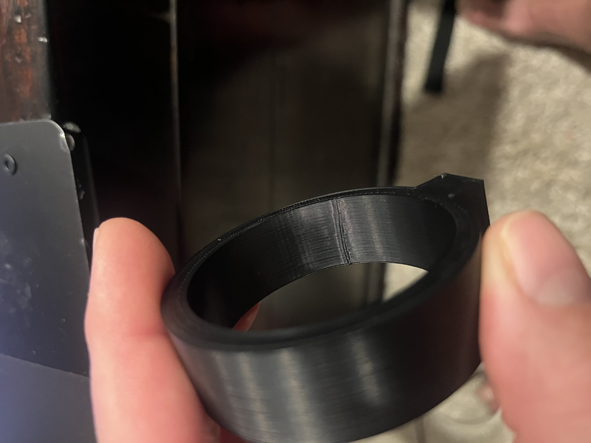

# Profile Integrity and Experimental Resets

A controlled test is only controlled when the printer, tool, nozzle, filament,
and process geometry are the ones the experiment claims to use. A slicer can
display a familiar profile name while inherited values, a stale project,
firmware state, or the selected physical tool describe a different setup.

This chapter explains how to recognize that failure, preserve the useful
evidence, and reset without discarding the whole tuning history.

## The Four Identities That Must Agree

Before accepting a tuning result, verify four independent descriptions of the
job:

| Identity | What to verify |
| --- | --- |
| Physical machine | Installed tool, actual nozzle diameter, nozzle condition, filament path, and active material |
| Printer profile | Compatible machine, tool index, nozzle diameter, firmware flavor, limits, offsets, and start G-code |
| Filament profile | Machine compatibility, temperature, flow, PA, MVS, cooling, retraction, and compensation |
| Process and output | Layer height, line widths, wall order, seam controls, selected tool, and the commands emitted in final G-code |

The profile label is evidence of intent, not proof of execution. Confirm the
resolved settings and the emitted file. For networked printers, compare the
important commands with live firmware state when practical.

## Preflight Identity Gate

Run this gate before the first calibration and after any nozzle, hotend,
firmware, slicer, or profile change:

1. Physically identify the selected tool and measure or verify its nozzle.
2. Confirm that the printer profile assigns that diameter to the same tool.
3. Confirm that layer height and every important line width are credible for
   that nozzle.
4. Confirm that the filament profile is compatibility-gated to the intended
   machine, tool, and nozzle.
5. Slice a small known model and inspect the final G-code for tool selection,
   temperatures, PA, MVS, fan behavior, line geometry, and unexpected material
   or auxiliary-tool commands.
6. Start a fresh project or restart the slicer if cached project state does not
   agree with the saved profiles.

Do not begin fine tuning until all six checks agree.

## Isolate Concurrent Slicer Sessions

When several printers are being tuned at once, do not reuse one live slicer
process for more than one physical print. Open a distinct application instance
with its own project and state for each job, and name the output after the
machine, material, tool, and purpose. A fresh project inside a shared process
is not always sufficient: cached tool assignments, inherited materials, and
queued uploads can survive between projects.

Before launching each physical print, home the printer and verify that the
remote job is actually associated with the intended uploaded file. An upload or
start request that times out is not proof of failure or success; check the
printer's live filename, state, tool, and targets before proceeding.

## Audit the Whole Tool Lifecycle

A multi-tool job is not safe to promote merely because its first tool command
is correct. Inspect the complete executable G-code, including start macros,
object assignments, transition/tool-change macros, purge or cutter routines,
and end G-code. Verify that each command which selects, loads, unloads, cuts,
or purges filament maps to the intended physical path.

This matters especially when a profile is remapped from a stale tool or a
different material system. An otherwise successful specimen can end by trying
to unload from an unintended lane, leaving the printer paused or faulted after
the geometry is complete. Treat that as a workflow defect to fix before the
next job, not as evidence that the selected material path worked.

## Warning Signs of a False Baseline

Stop and re-audit identity when:

- many seam settings move or spread the defect but never remove it;
- a modest setting change creates a disproportionately large visual change;
- the best value keeps landing at the edge of the tested range;
- line widths or layer heights look appropriate for a different nozzle;
- a project behaves differently after reopening even though the named profile
  appears unchanged;
- final G-code selects a different tool or emits commands not expected for the
  intended material path;
- a formerly stable profile changes immediately after hardware or firmware
  work;
- machine faults, failed probing, or nozzle damage make the baseline
  non-repeatable.

Repeated machine faults are not filament data. Suspend material tuning until
the machine can repeat its baseline, and record those events separately from
accepted and rejected material experiments.

## Worked FibreSeek Seam Reset

A FibreSeek ABS tuning sequence produced a broad disturbed band at the aligned
rear seam of a circular part. Conventional seam gaps, scarf height, scarf
length, scarf step count, scarf flow, scarf speed, entire-loop scarfing,
inner-wall scarfing, and staggered inner seams were tested one variable at a
time.

The trials taught useful local lessons:

- scarfing moved or spread the disturbance but did not remove it;
- more scarf steps made the transition worse;
- reducing scarf flow past the best trial reopened the defect;
- longer and entire-loop scarfing distributed the error over more wall;
- staggered inner seams created several disturbed regions instead of one;
- increasing conventional seam gap eventually opened the seam while retaining
  adjacent ridges.

Those are valid observations about the failure mode, but they were not valid
profile-acceptance results. A later audit found that the coupons had been
sliced as if the plastic tool used a `0.6 mm` nozzle, with `0.30 mm` layers and
approximately `0.60/0.63 mm` outer/inner line widths. The installed plastic
tool and the machine configuration identified that nozzle as `0.4 mm`.



The experiment was reset on the same geometry with the true `0.4 mm` plastic
tool, `0.20 mm` layers, `0.40/0.42 mm` outer/inner line widths, the established
`0.030` pressure-advance value, inner-before-outer walls, an aligned rear seam,
and no scarf, stagger, or wipe. The broad disturbed zone collapsed into one
narrow, straight, repeatable seam while the surrounding wall remained smooth.



The improvement came from restoring the correct baseline, not from discovering
a universal FibreSeek seam value. The next seam-gap adjustment remained a
candidate until a functional production part could confirm it.

## How to Reset Without Losing the Experiment

1. Freeze the current files and mark their status honestly.
2. Label results made under a mismatched identity as `rejected - invalid
   baseline`, not merely `bad print`.
3. Preserve observations that remain useful, such as whether scarfing spread a
   disturbance or whether a fan change had no effect.
4. Restore the last verified physical and profile identity.
5. Re-slice the exact same geometry with conservative, ordinary settings.
6. Change no cosmetic control until the corrected baseline prints repeatably.
7. Resume with the smallest one-variable test that addresses the remaining
   defect.

This procedure separates two questions: whether a setting can influence the
symptom, and whether its numerical value is valid for the intended setup.

## Keep Tuned Profiles Machine-Specific

A filament profile contains machine-dependent values even when the spool is the
same. PA, MVS, retraction, cooling response, temperature under flow, and
dimensional compensation depend on the extruder, hotend, nozzle, duct, motion,
and enclosure.

Use a distinct profile for each validated machine/tool/nozzle combination:

```text
Material + printer + tool/nozzle + purpose + revision
```

Compatibility-gate the profile to that printer definition. Preserve the
generic or supplier profile as a parent or untouched reference. Do not let a
tuned FibreSeek profile silently appear as a valid choice for another printer.

## Promotion Gate

Before calling a reset profile accepted:

- verify the selected physical tool and nozzle again;
- inspect resolved printer, filament, and process values;
- inspect final G-code for effective tool, PA, temperatures, fan commands,
  line geometry, and unintended auxiliary-tool commands;
- reproduce the corrected result from a clean project;
- print a representative functional part;
- measure required dimensions and fits after cooling;
- record provisional values separately from accepted values.

The functional part is the final judge. A calibration ring can show that the
seam transition is controlled, but it cannot prove fit, strength, long-layer
behavior, or production reliability.

Return to [Foundations](01-foundations.md) when the identity gate fails. Return
to [Seams and Surface Quality](08-seams-and-surfaces.md) when the corrected
baseline leaves one localized transition. Finish with [Validation and Profile
Release](09-validation.md) before promoting the machine-specific profile.
